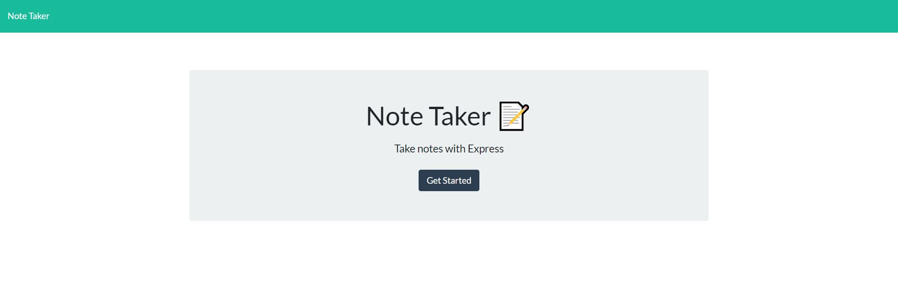
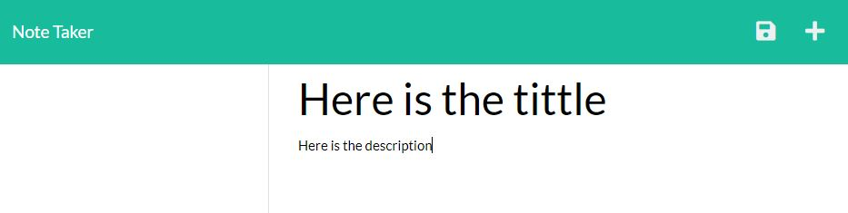
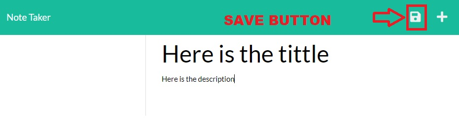
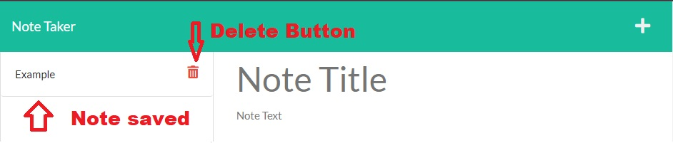

#  11 Express.js: Note Taker

 an application called Note Taker that can be used to write and save notes. This application will use an Express.js back end and will save and retrieve note data from a JSON file.


## Contents

1. [About](#about)
    1. [User Story](#user%20story)
    2. [Acceptance criteria](#acceptance%20criteria)
    3. [Visuals](#visuals)
    4. [Data](#data)
    5. [Build](#build)
2. [Contributing](#contributing)

### About

Developers are often tasked with retrieving data from another application's API and using it in the context of their own. Third-party APIs allow developers to access their data and functionality by making requests with specific parameters to a URL. Your challenge is to build a weather dashboard that will run in the browser and feature dynamically updated HTML and CSS.

### User Story

   ```
AS A small business owner
I WANT to be able to write and save notes
SO THAT I can organize my thoughts and keep track of tasks I need to complete
```

### Acceptance Criteria

  
```
GIVEN a note-taking application
WHEN I open the Note Taker
THEN I am presented with a landing page with a link to a notes page
WHEN I click on the link to the notes page
THEN I am presented with a page with existing notes listed in the left-hand column, plus empty fields to enter a new note title and the note’s text in the right-hand column
WHEN I enter a new note title and the note’s text
THEN a Save icon appears in the navigation at the top of the page
WHEN I click on the Save icon
THEN the new note I have entered is saved and appears in the left-hand column with the other existing notes
WHEN I click on an existing note in the list in the left-hand column
THEN that note appears in the right-hand column
WHEN I click on the Write icon in the navigation at the top of the page
THEN I am presented with empty fields to enter a new note title and the note’s text in the right-hand column
```


### Usage:



This is the main page for the aplication, in this page the user just need to click on the button to start using the Note Taker



The usage is very simple, the user have an space for the tittle of the note, and another space for the description as well. Both must be filled



Once that user has added a tittle and a description, in order to save the note the user must click on save button. 



When the user click on save, the note will appear in the left side of the screen, if the user click on the note this will appear in the screen again, or can delete it by clicking delete button.

## Data

On the back end, the application should include a `db.json` file that will be used to store and retrieve notes using the `fs` module.

The following HTML routes should be created:

* `GET /notes` should return the `notes.html` file.

* `GET *` should return the `index.html` file.

The following API routes should be created:

* `GET /api/notes` should read the `db.json` file and return all saved notes as JSON.

* `POST /api/notes` should receive a new note to save on the request body, add it to the `db.json` file, and then return the new note to the client. You'll need to find a way to give each note a unique id when it's saved (look into npm packages that could do this for you).


## Build

  * Application front end must connect to an Express.js back end.

  * Application back end must store notes that have a unique id in a JSON file.

  * Application must be deployed to Heroku.


### Contributing
Made by [Daniel-lago](https://github.com/Daniel-lago)


### ©️2022 Daniel Lago
